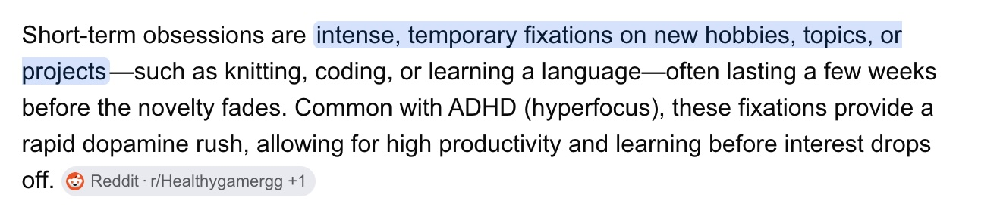

import SideNote from "../components/SideNote.astro";

export const paperCite = (

<>
  Ashinoff &amp; Abu-Akel (2021). “Hyperfocus: the forgotten frontier of
  attention.” <em>Psychological Research</em> 85:1–19.{" "}
  <a
    href="https://doi.org/10.1007/s00426-019-01245-8"
    target="_blank"
    rel="noopener noreferrer"
  >
    doi.org/10.1007/s00426-019-01245-8
  </a>
</>
);

# Notes

## 8 September 2026

Claude had this "Thought" today:

> "Her website reads as art not a shop"

### On Science and AI

When you ask AI "give me tips for coping with my ADHD backed by science", the AI (a bot) does not by default have access to the "science" you think. In general bots are blocked from accessing scientific papers. The bot will however have access to "interpretations" of the papers from website that do not block bots, e.g. this one. Unfortunately, increasingly these websites also have been written by AI (because why would someone give AI bots knowledge for free without any reward - page click).

### Hyperfocus

As part of a rabbit hole of trying to understand how to make Google say "short obsessions is a website/shop/blog", rather than quoting r/Healthygamergg<SideNote></SideNote> when you Google "short obsessions", I went off on a adventure to learn about "short obsessions".

Firstly, the term "short obsessions" is not a scientific one, and it also has little to do with the word "obsession" within OCD. However, the term "hyperfocus" has recently gained traction in the science community. The paper "Hyperfocus: the forgotten frontier of attention", Ashinoff & Abu-Akel (2021)<SideNote>{paperCite}</SideNote> is not only a good starting point but it is also quite readable. Most interestingly it argues that "Hyperfocus" might be the same phenomenon as "Flow"<SideNote>"Flow" is Mihály Csíkszentmihályi's term (1990) for total, effortless absorption in a task. [missing reference]</SideNote> viewed through different lenses.

> Hyperfocus, broadly and anecdotally speaking, is a phenomenon that reflects one’s complete absorption in a task, to a point where a person appears to completely ignore or ‘tune out’ everything else.

Let's compare the criteria for Hyperfocus and Flow side by side:

| Hyperfocus criteria                                                                                                                                                | Corresponding flow criteria / experiences                                                                                                                                                                                            |
| ------------------------------------------------------------------------------------------------------------------------------------------------------------------ | ------------------------------------------------------------------------------------------------------------------------------------------------------------------------------------------------------------------------------------ |
| Hyperfocus is characterized by an intense state of concentration/focus                                                                                             | Intense and focused concentration on the present moment                                                                                                                                                                              |
| When engaged in hyperfocus, unrelated external stimuli do not appear to be consciously perceived; sometimes reported as a diminished perception of the environment | Merging of action and awareness Loss of reflective self-consciousness (i.e., loss of awareness of oneself as a social actor) Distortion of temporal experience (typically a sense that time has passed faster than normal) |
| To engage in hyperfocus, the task has to be fun or interesting                                                                                                     | Experience of the activity as intrinsically rewarding, such that often the end goal is just an excuse for the process Perceived challenges, or opportunities for action, that stretch but do not overmatch existing skills      |
| During a hyperfocus state, task performance improves                                                                                                               | A sense that one can control one's actions; that is, a sense that one can in principle deal with the situation because one knows how to respond to whatever happens next                                                             |

_Adapted from Ashinoff & Abu-Akel (2021), "Hyperfocus: the forgotten frontier of attention", Table 2._<SideNote>{paperCite}</SideNote>

Personally, I have noticed that I am the most "hyperfocused" when going on one of my "internet adventures". That is when I search for answers on "how?", "when?", etc. Each one of these searches, also ends up making me buy a new books (by the time they arrive however, the "obsession" has moved on to the new thing)

<footer class="md-notes">

# Things I could cover but stopped myself

Below are some notes that could spiral into other research

- George Loewenstein (1994, _Psychological Bulletin_ 116(1):75) proposed the information-gap theory: curiosity is "a cognitively induced deprivation that arises from the perception of a gap in knowledge and understanding." Curiosity peaks at moderate gaps and dies when knowledge is either 0% (nothing to grab onto) or 100% (nothing left to want).

- Loewenstein argued that information-seeking is driven more by the aversiveness of not knowing than by the anticipated pleasure of finding out.

- Todd Kashdan built the Curiosity and Exploration Inventory (CEI: Kashdan, Rose & Fincham 2004; CEI-II: Kashdan et al. 2009) with "stretching" and "embracing" factors, linking trait curiosity to wellbeing, meaning, and life satisfaction (Kashdan & Steger 2007).

- Jordan Litman & Charles Spielberger developed the I/D model of epistemic curiosity, distinguishing Interest-type ("I," the pleasurable anticipation of learning something new) from Deprivation-type ("D," the aversive, tension-laden need to close a specific gap). The D-type is the direct answer to "why does not-knowing sometimes feel annoying?" — and it is essentially the affective extension of Loewenstein's information-gap theory.

- Litman & Jimerson (2004) built a dedicated instrument for it, the Curiosity as a Feeling-of-Deprivation Scale (CFDS), and found that, unlike the positively valenced I-type, D-type curiosity correlates positively with anxiety, depression, and anger — the itch of an unresolved gap is genuinely unpleasant. Loewenstein himself argued that "information seeking is motivated by the aversiveness of not possessing the information more than it is by the anticipation of pleasure from obtaining it" (1994). Litman (2005) tied the two types to Berridge's neuroscience: D-type is "wanting" (needing to resolve), I-type is "liking" (enjoying the discovery).

- Later studies of students with ADHD have found conflicting relation between flow and hyperfocus:
  > ["experiences of hyperfocus may be different from flow because they are experienced as less controllable, with less clear goals and feedback from the activity at hand, and holding less of a challenge of the activity for the individual."](https://chadd.org/attention-article/hyperfocus-in-college-students-with-adhd/#:~:text=Examining%20the%20pattern,affect%20the%20results.)

</footer>
